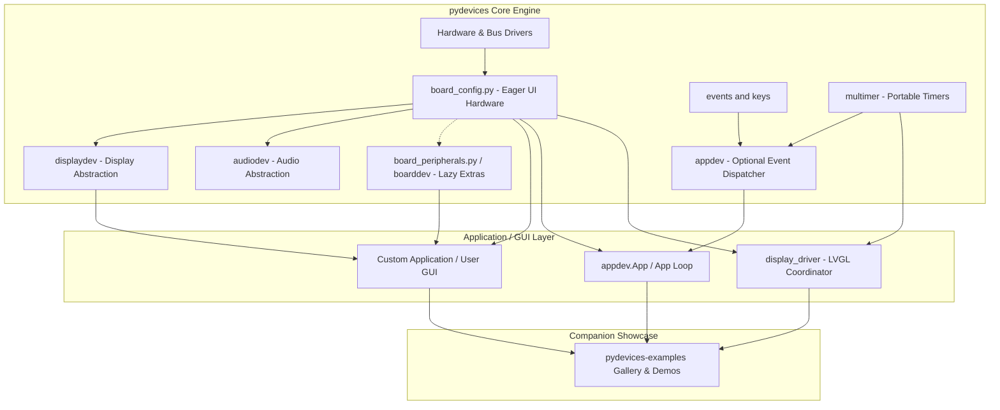

# Architecture

`pydevices` is the core product layer, owning portable hardware interfaces, driver abstractions, board wiring contracts, and releases.

Applications build directly on the **PyDevices Board Contract** and core packages (`displaydev`, `audiodev`, `appdev`, `multimer`). Downstream showcases like `pydevices-examples` consume this layer as companion sample code.

## Component diagram



## Core Responsibilities

| Piece | Role |
|---|---|
| `board_config.py` | Primary Board Contract: initializes eager UI hardware (`display_drv`, touch, buttons) and exports neutral capability flags. |
| `board_peripherals.py` / `boarddev` | Board Contract extension: provides lazy, on-demand access to extra hardware (sensors, battery monitors, external storage). |
| `displaydev` | Cross-platform display interfaces (`BusDisplay`, `FBDisplay`, `SDLDisplay`, `PyScriptDisplay`). |
| `audiodev` | Cross-platform audio output/input interfaces (`I2SAudio`, `SDLAudio`). |
| `events` / `keys` | Neutral event definitions, key codes, modifier keys, and touch gestures. |
| `multimer` | One `machine.Timer`-shaped `Timer` on every host, with the clock, `sleep_ms`, `schedule`, `hold` and `report`. |
| `appdev` | Optional event traffic controller and input queue for applications using native PyDevices dispatch. |
| `display_driver` | LVGL coordinator bridging LVGL widgets to `displaydev` and `multimer`. |

## Standard Application Boot Sequence

1. Install `pydevices` or your board's `board_config` via MIP or pip.
2. Import `display_drv` from `board_config`.
3. Draw directly or bind your choice of UI toolkit (`pdwidgets`, `lvgl`, or raw framebuffers).
4. Run your application event loop.

```python
from board_config import display_drv

# Draw to the display hardware
display_drv.fill_rect(0, 0, 100, 50, 0xF800)
display_drv.show()
```

## Choosing a GUI layer

PyDevices supports several graphical approaches; pick by how much you need and
what you can compile:

| Approach | Use it for | Package |
|---|---|---|
| **Raw graphics / canvas** | Direct pixel, line, and shape drawing | [`displaydev`](displaydev.md) with [`pygraphics`](https://github.com/PyDevices/pygraphics) |
| **Pure-Python GUI** | Portable buttons, lists, themes, and screen management with nothing to compile | [`pdwidgets`](https://github.com/PyDevices/pdwidgets) |
| **C-native GUI** | Complex vector widgets and a C-accelerated animation engine | [`lvgl`](https://github.com/PyDevices/lvgl-bindings) — see [using LVGL with PyDevices](https://github.com/PyDevices/lvgl-bindings/blob/main/docs/using-lvgl-with-pydevices.md) |

All three sit on the same board contract, so the choice does not change how your
hardware is configured.

## Where to go next

- [Board Contract Specification](board-peripherals.md) — eager vs lazy board hardware
- [Board Config Inventory](board-configs.md) — supported MCU & desktop boards
- [Display Drivers](displaydev.md) — display interfaces and backends
- [multimer](multimer.md) — portable timers and async support
- [Companion Demos](https://pydevices.github.io/pydevices-examples/) — sample applications
